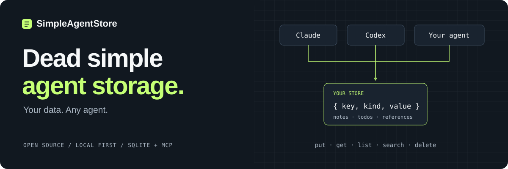

<p align="center">
  
</p>

<p align="center">
  <a href="https://github.com/darkrishabh/simple-agent-store/actions/workflows/ci.yml"></a>
  <a href="./LICENSE"></a>
  
  
  
  
</p>

<p align="center">
  <a href="https://darkrishabh.github.io/simple-agent-store/">Project website</a> ·
  <a href="#the-idea-in-10-seconds">The idea</a> ·
  <a href="#try-it-locally">Quick start</a> ·
  <a href="./docs/GETTING_STARTED.md">Connect your agents</a> ·
  <a href="./docs/ARCHITECTURE.md">Architecture</a> ·
  <a href="./CONTRIBUTING.md">Contribute</a>
</p>

## Save in Claude. Find in Codex.

**One place for the things you tell your agents to keep.**

SimpleAgentStore is a small, user-owned object store. Connect your agents to the same store, save something in one conversation, and retrieve it from another agent later. Your data lives in a local SQLite file—not inside a particular agent's chat history.

**A shared notepad for your agents—not a memory system.** No embeddings, no RAG pipeline, no silent remembering. Save explicitly. Retrieve when you need it.

Previously named AgentStore? See the [rename and upgrade guide](./docs/UPGRADING.md). Existing database paths and `AGENTSTORE_*` configuration remain supported unchanged.

### The idea in 10 seconds

| You say | Your connected agent does |
| --- | --- |
| “Save this to my notes: the launch checklist is ready.” | Writes a structured note to SimpleAgentStore. |
| “What did I save about the launch?” | Searches for candidates, then fetches the selected object. |
| “Show me all my notes.” | Lists your notes, following every cursor page. |

**Switch agents. Keep your stuff.** All clients must connect to the same database/server. The optional routing skill helps turn ordinary save/retrieve requests into tool calls; write approvals and model behavior still apply.

## Small core. Useful things.

| What you get | Why it matters |
| --- | --- |
| **Five operations** | `put` · `get` · `list` · `search` · `delete`. That's the core. |
| **Objects, not just text** | Stable keys, kinds, labels, arbitrary JSON values, versions, timestamps, and optional TTL. |
| **Inspectable retrieval** | Structured filters, prefix-aware FTS5, indexed labels, and phone/email/URL shape matching. |
| **Complete lists** | Cursor pagination and total counts—not a silently truncated first page. |
| **A CRUD dashboard** | Browse, search, inspect, create, edit, and delete in your browser. |
| **Agent adapters** | MCP over stdio or Streamable HTTP, plus optional Codex and Claude routing plugins. |

## Try it locally

### Docker — recommended

Requires Docker with Compose v2. No Node.js or database installation needed:

```bash
git clone https://github.com/darkrishabh/simple-agent-store.git
cd simple-agent-store
docker compose up --build -d --wait
```

Open **[localhost:4310](http://127.0.0.1:4310)**. MCP is at **`http://127.0.0.1:4311/mcp`**.
Both services share a persistent SQLite volume. No database credentials are needed.
Install the [bundled Codex or Claude plugin](./docs/GETTING_STARTED.md) to get the MCP connection and routing skill together.

Stop with `docker compose down`; your data stays. See [Docker setup and backups](./docs/DOCKER.md).

### Native Node.js

Requires **Node.js 22+**. Do not run this alongside Docker on the same ports:

```bash
git clone https://github.com/darkrishabh/simple-agent-store.git
cd simple-agent-store
npm ci
npm run dashboard
```

Open **[localhost:4310](http://127.0.0.1:4310)** to create your first object.

In a **second terminal**, from the repository root:

```bash
npm run mcp:http
```

Your local MCP endpoint is **`http://127.0.0.1:4311/mcp`**. The dashboard and MCP server share `data/agentstore.sqlite` by default.

To choose another SQLite file, set `AGENTSTORE_DB_PATH` in `.env` (see [.env.example](./.env.example)). PostgreSQL is **not implemented**; a PostgreSQL connection URL will not work. Docker uses its own named volume, separate from the native database.

→ **[Connect Codex or Claude, install routing plugins, and configure HTTPS](./docs/GETTING_STARTED.md)**

> SimpleAgentStore is an open-source alpha for local, single-user use. It is not a production hosted or multi-tenant service.

## What gets saved?

A predictable envelope around **your** payload:

```json
{
  "key": "notes/launch-checklist",
  "kind": "note",
  "labels": ["launch", "product"],
  "value": {
    "text": "The launch checklist is ready."
  }
}
```

SimpleAgentStore adds version and timestamp metadata. Kinds are `note`, `todo`, `reminder`, `calendar`, `reference`, and `other`. The value can be any JSON—not just a document or string.

## Smart agent. Predictable store.

**The agent interprets what you mean. The store executes the query.**

`search` returns compact candidates with scores, matched fields, and snippets. `get` returns the full object. No LLM calls, embeddings, or automatic classification happen inside SimpleAgentStore.

Lexical search has limits: paraphrases and typos may need the calling agent to try shorter terms or close synonyms. A high ranking is a retrieval signal, not proof that an object answers the question.

### Intentionally not

RAG. A vector database. A knowledge graph. Hidden agent memory. A workflow or reminder engine.

MCP is **an adapter**, not the canonical protocol. SQLite is **the MVP backend**, not the product boundary. Store information now; let the agent decide how to use it later.

## Built to be checked

```bash
npm run check
npm test
npm run build
npm audit
```

Tests cover CRUD, versioning, TTL, FTS synchronization, structured and shape filters, migration, complete pagination, large-store label retrieval, MCP responses, and HTTP authentication.

With Docker running, `npm run test:docker` tests a temporary Compose stack: cross-client save/search/get, paginated lists, dashboard edits, direct SQLite verification, authentication, and persistence after container recreation. It does not touch your normal store.

## Open-source core

SimpleAgentStore is licensed under **[Apache-2.0](./LICENSE)**. Contributions are welcome when they preserve the small deterministic core.

- **[Architecture](./docs/ARCHITECTURE.md)** — components, object contract, retrieval, and trust boundaries
- **[Compatibility](./docs/COMPATIBILITY.md)** — tested runtimes, platforms, clients, and upgrade expectations
- **[Database operations](./docs/DATABASE_OPERATIONS.md)** — backup, restore, migrations, locking, and recovery
- **[Security policy](./SECURITY.md)** and **[threat model](./docs/THREAT_MODEL.md)** — private reporting and deployment limits
- **[Contributing](./CONTRIBUTING.md)**, **[support](./SUPPORT.md)**, and **[code of conduct](./CODE_OF_CONDUCT.md)**
- **[Changelog](./CHANGELOG.md)** and **[release process](./docs/RELEASING.md)**

See **[OSS_READINESS.md](./OSS_READINESS.md)** for the verified release posture and the separate work required for a hosted service.

---

<p align="center"><strong>Your objects. Your store. Your choice of agent.</strong></p>
